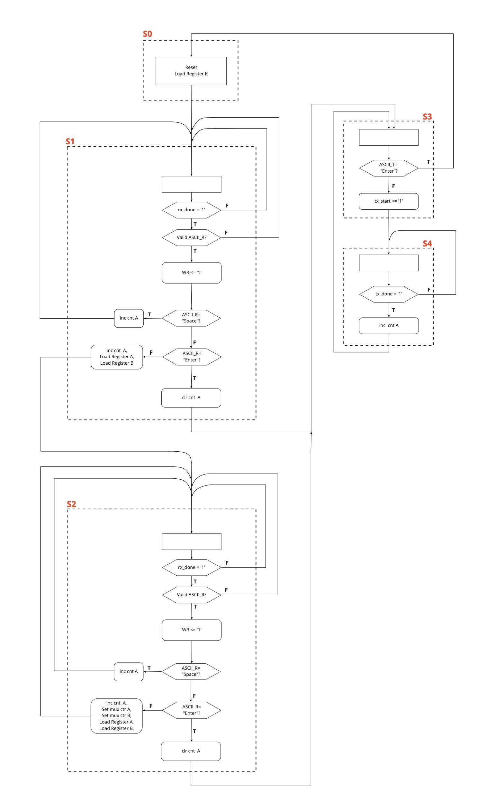

## Autoclave Cipher Hardware Implementation on Basys 3 Board

#### The following block diagram represents the FSMD architecture of the implementation of Autoclave Cipher in hardware.

#### The following ASMD chart represents the required states to implement the functionality of Autoclave Cipher

