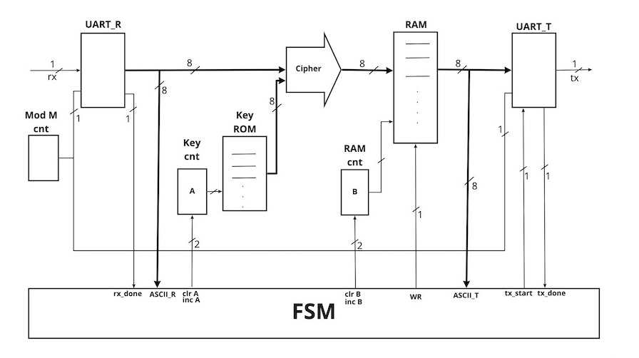
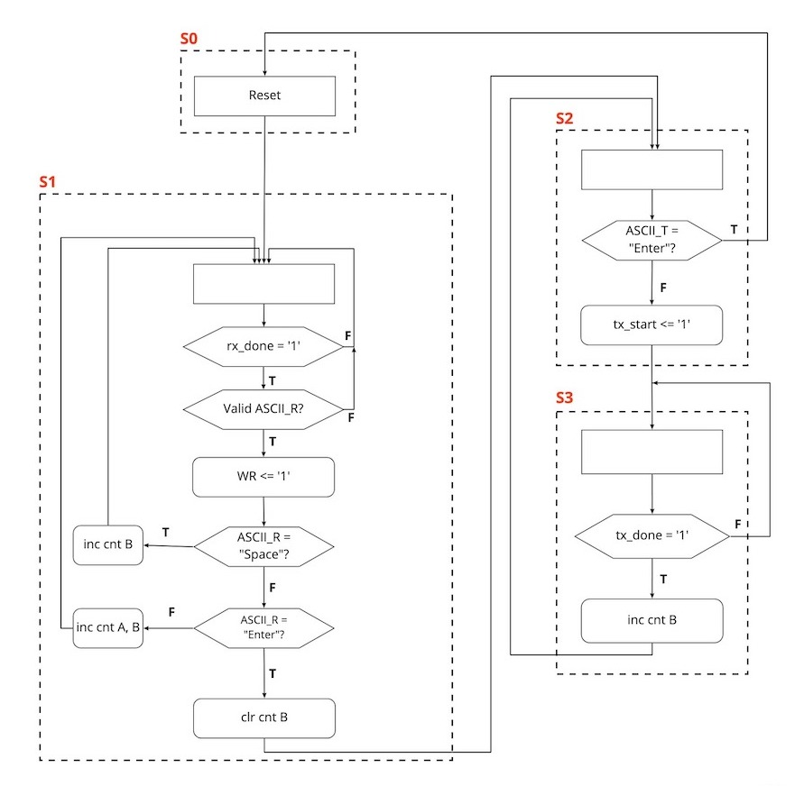

## Porta-Table Cipher Hardware Implementation on Basys 3 Board

### Implementation is done according to this FSMD and ASMD diagrams.

#### The block diagram represents the FSMD architecture of the implementation of Porta-Table Cipher in hardware.

#### The ASMD chart represents the required states to implement the functionality of Porta-Table Cipher

